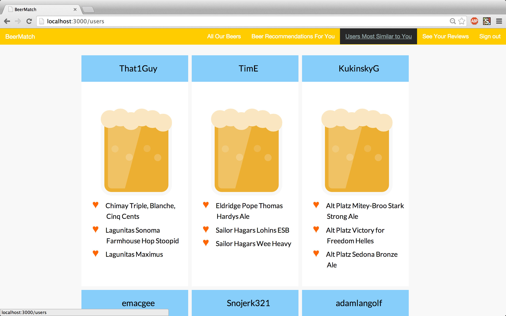
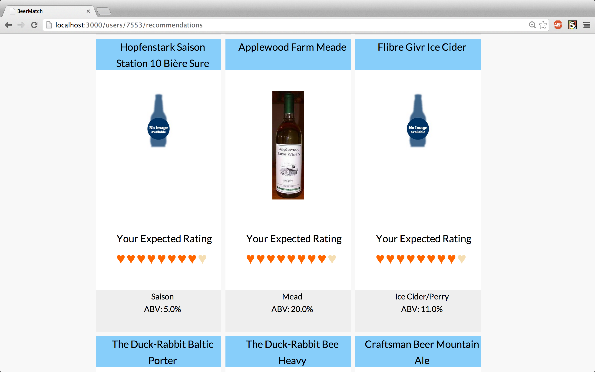
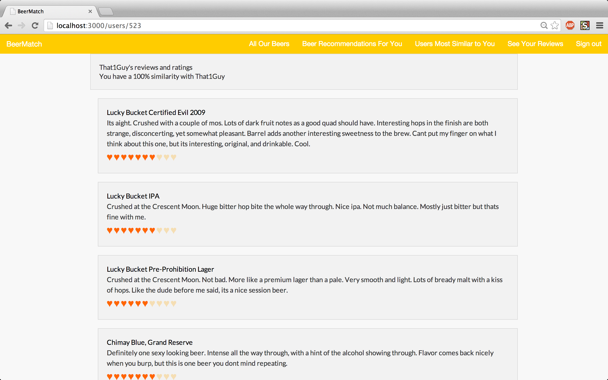

BeerMatch is a beer recommendation engine based on machine learning and collaborative filtering algorithms and RateBeer's extensive reviews. Access to such extensive reviews could not have been possible without the assistance of Professor Julian McAuley of UCSD, who was was kind enough to share the data with me. More on his research around beer and recommendations can be found here: http://snap.stanford.edu/data/web-RateBeer.html

Here are some screenshots of BeerMatch

Similar Users:


Beer Recommendations:


Beer Reviews by User:


BeerMatch can be tried at the following URL: http://beermatch.herokuapp.com

For the most up to date version of BeerMatch, you can also clone the repo down and try it out on your own machine.

```
git clone git@github.com:vikram7/beer-recommender.git
rake db:create
rake db:migrate
```
Note, please contact me directly as you will need access to the RateBeer data which the company has asked not to share publicly. After this, you can seed the database and produce relevant recommendations as noted below:

```
rake db:seed
rake dictionary:populate
rake beerid:populate
```
And then you're good to go!

Also, because there's a lot of information in this README, I thought a condensed version of technical challenges and highlights would be useful:
```
1. Determining the right algorithm to use for a recommendation engine. I went with
Toby Segaran's 'Programming Collective Intelligence' and found some good guidance
there on collaborative filtering.

2. Improving the runtime for the recommendation algorithm. Initially, I wrote it
very functionally with unnecessary complexity. Spending time refactoring it got the
runtime down from 3 hours to 3 minutes.

3. 3 minutes for a recommendation was still too long, so by requiring a minimum
similarity score between users, the runtime dropped to 19 seconds. Additionally, I
found out that object instantiation in Ruby due to ActiveRecord was expensive, so
replacing it with raw SQL brought down the runtime to a few seconds.
```

Below is a detailed tally of my work and features to come / features to fix / check / etc. in case you don't feel like reading all my commits.

Sep 16, 2004
- parser complete
- er diagram complete

ER Diagram:


Sep 20, 2004
- get db schema down
  - write ActiveRecord models
    - update for validations
  - import data into postgres db

- September 2004 Todos
  - figure out efficiency issue with seed uploader
  - create visual diagram of how the recommendation engine works
  - add ! to create methods in seeders so if it  fails if create/save doesn't work: "you should try using #create! instead of #create so that you receive an error if the create fails. It's also probably good to use #find_or_create! so that you can run the script multiple times without creating duplicates."
  - UI for ratings & reviews
    - user stories & wireframes
    - user finds beer and reviews it
    - after x amount of beers, the recommendation engine is unlocked
  - capybara and unit tests
  - research algorithms
    - cs problems with optimal algorithms (consider what kinds of filters you would use)
    - apply different algorithms to the same problem and see what kinds of algorithms give you the best results (adapter pattern)
- think about ways to present findings
- refactor parser

- October 2, 2014
  - main page of 3700 beers took around 5960 ms to load (found this from mini profiler); 375 sql queries
  - looked into eager loading and some other methods to speed up query of all beers
  - add indices to all foreign keys

- October 5, 2014
  - added devise gem for user registration
  - updated seed file for allowing required user inputs from devise
  - added ability for user to add reviews of beers
  - added unit tests for models
  - added feature tests for signing up, singing in and out
  - added feature tests for user to add a review and rating for a beer
  - found out why seeding was failing at review ~86k ("la-saint-pierre-blonde-de-l`oncle-hansi-" was some extra text appended to the brewer id in some of the beers. need to make sure to watch for this in the future (when going for 4mm records))
  - added more links between users and beers and ratings to allow clicking through them

- October 6, 2014
  - indexed foreign keys
  - Prior to indexing foreign keys: importing all 4348 beers took 10,786 ms and 414 sql queries (learned through my profiler); after adding foreign keys, this took 10,632 ms and 414 sql queries.
  - worked on similarity algorithms and methods


- October 7, 2014
  - simpearson calculation was resulting in a denominator of 0 for two users with no mutually rated beers. fixed so that method returns 0 if there are no mutually rated beers (as opposed to "NaN" which was getting returned before)
  - top_matches method which returns the top 10 highest pearson similarity scores and user id's
  - added the score related methods to a module Score in models.
  - create migration for pg JSON dictionary data
  - wrote populate.rake file in lib/tasks to populate dictionary db table with most recent rating data (run with rake dictionary:populate)
  - Score module self methods to calculate pearson similarity score and other statistics
  - update users view to show top similar users

- October 8, 2014
  - installed foundation, which slowed down views dramatically
  - installed navbar
  - worked on Score module

- October 9, 2014
  - adjusted navbar so that a first time user doesn't see top ten option until dictionary has been repopulated with that new user's reviews
  - added pagination
  - looked at SQL commands to replace ruby work for Score Module
    - SQL for average beer rating: ActiveRecord::Base.connection.execute("SELECT beer_id, AVG(taste) FROM reviews GROUP BY beer_id")
    - SQL for pearson corr: ActiveRecord::Base.connection.execute("SELECT corr(u1.taste, u2.taste) from reviews u1 inner join reviews u2 on u2.beer_id = u1.beer_id where u2.user_id = 2 and u1.user_id = 1")
    - SQL for top matches:
  - Cut out most methods from Score module and combined the necessary ones into the recommendations method -- this reduced the recommendation time from 4 hours to 3 minutes
  - Adjusting the minimum correlation to 0.50 reduced the recommendation time from 3 minutes to 19 seconds)
  - I think the dictionary is faster to traverse in ruby than tables in SQL. If that's the case, maybe I should make dictionaries for everything

- October 10, 2014
  - product recs

- October 14, 2014
  - updated beers views to be more appealing, fit pictures

- October 15, 2014
  - more styling on beers pages

- October 16, 2014
  - working on rewriting the Score Module to work with a JSON instead of repeated database queries

- October 17, 2014
  - added SQL commands to replace ruby work in Score Module. this sped up recommendation calculator by a ton (went from 19 seconds down to 4 after this)
  - some front end work

- October 18, 2014
  - added top 3 beer picks method to score module for a user
  - added animated beers to similar users page
  - updated styling
  - deployed
  - added average method for beer ratings through SQL aggregator in Score Module
  - figured out how to include new users into similarity rankings, but dictionary json payload update is slow and need to figure out how to speed it up

- October 19, 2014
  - cleaned up front end
  - added filled in and opaque hearts for ratings
  - crisper styling
    - fixed beer flask in css
    - more eager loading to users and reviews
    - user has_many beers through reviews added to model
  - HIGH PRIORITY TODOS
    - speed up dictionary json payload
    - deployed, CSS is different though versus local version and need to figure out why; pagination is off in deployed version too and also need to figure this out
    - add minimum # of beer review notification
    - add cached average rating to each beer
    - look into sidekiq
    - visualizations (spider plots, donut plots) -- like how your beers compare to others, etc.
