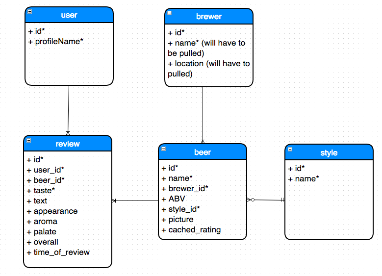

Beer Recommendation Engine

- October 5, 2014
  - added devise gem for user registration
  - updated seed file for allowing required user inputs from devise
  - added ability for user to add reviews of beers
  - added unit tests for models
  - added feature tests for signing up, singing in and out
  - added feature tests for user to add a review and rating for a beer
  - found out why seeding was failing at review ~86k ("la-saint-pierre-blonde-de-l`oncle-hansi-" was some extra text appended to the brewer id in some of the beers. need to make sure to watch for this in the future (when going for 4mm records))

- October 2, 2014
  - main page of 3700 beers took around 5960 ms to load (found this from mini profiler); 375 sql queries
  - looked into eager loading and some other methods to speed up query of all beers
  - add indices to all foreign keys

Current Todos:

- figure out efficiency issue with seed uploader

- create visual diagram of how the recommendation engine works

- figure out why only 86k / 100k records are getting uploaded:
```
Creating brewer with id: 5546
Creating beer with name: La Saint-Pierre Blonde de l`Oncle Hansi
rake aborted!
ActiveRecord::RecordInvalid: Validation failed: Name has already been taken
```

- add ! to create methods in seeders so if it  fails if create/save doesn't work: "you should try using #create! instead of #create so that you receive an error if the create fails. It's also probably good to use #find_or_create! so that you can run the script multiple times without creating duplicates."
- add indexes

- butttt I think you want to look at this for why your data isn’t all getting in there https://github.com/vikram7/beer-recommender/blob/master/app/models/review.rb#L9-L10 you’re saying that a user can only review one beer as having a particular taste rating. so as a user i couldn’t review two different beers as having a 3 for taste

- also http://guides.rubyonrails.org/active_record_validations.html#presence "If you want to be sure that an association is present, you'll need to test whether the associated object itself is present, and not the foreign key used to map the association."

- you should read this post too https://tomafro.net/2009/08/using-indexes-in-rails-choosing-additional-indexes. you should also use indexes to make sure that column entries really are unique at the database level. and if you’re scoping them, you need to use a compound index. and if you’re scoping them, you need to use a compound index. like add_index :reviews, [:beer_id, :user_id], unqiue: true. i would probably make separate migrations for each of the tables that you’re adding indexes to

- write user stories

- UI for ratings & reviews
  - user stories & wireframes
  - user finds beer and reviews it
  - after x amount of beers, the recommendation engine is unlocked

- capybara and unit tests

- research algorithms
  - cs problems with optimal algorithms (consider what kinds of filters you would use)
  - apply different algorithms to the same problem and see what kinds of algorithms give you the best results (adapter pattern)

- think about ways to present findings

- refactor parser

Sep 20, 2004
- get db schema down
  - write ActiveRecord models
    - update for validations
  - import data into postgres db

Sep 16, 2004
- parser complete
- er diagram complete

ER Diagram:


